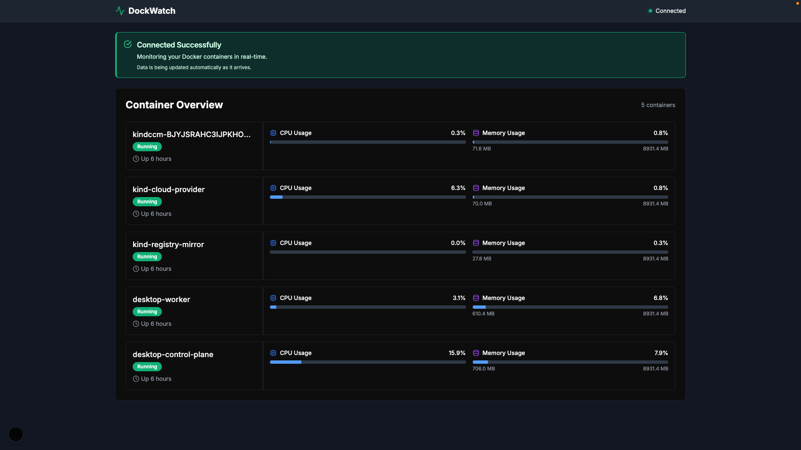

# DockWatch UI

## Overview
DockWatch UI is a web-based user interface for monitoring and managing Docker containers. It provides a simple and intuitive way to view the status of your containers, view logs, and perform basic management tasks.

## Installation
1. Clone the repository:
   ```bash
    git clone git@github.com:InspectorGadget/dockwatch-ui.git
    cd dockwatch-ui
    ```
2. Install dependencies:
    ```bash
     npm install --legacy-peer-deps
     ```
3. Run the project:
    ```bash
     npm run dev
     ```
4. Open your browser and navigate to `http://localhost:3000` to access the DockWatch UI.

## Video Demo
[](./videos/DockWatch.gif)
